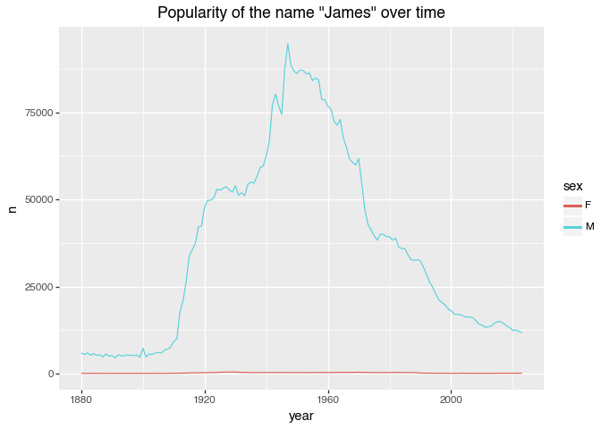
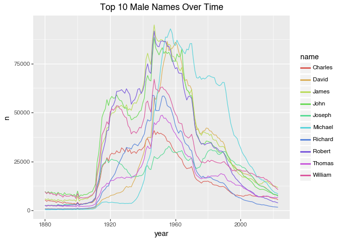
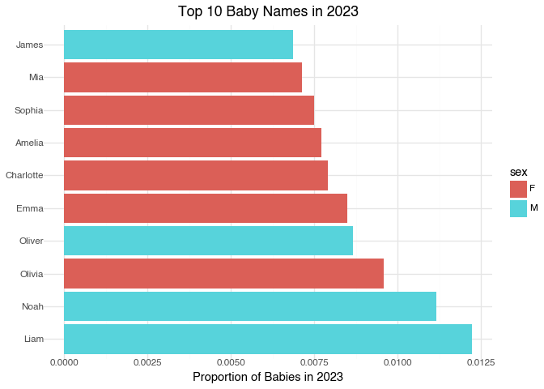

# Babynames Exercise (Python Version)
Thomas Brambor

- [Introduction](#introduction)
- [Analysis](#analysis)
  - [Data Loading](#data-loading)
  - [Data Exploration](#data-exploration)
  - [Single Name Analysis](#single-name-analysis)
  - [Top 10 Names Analysis](#top-10-names-analysis)
  - [Recent Trends (Latest Year)](#recent-trends-latest-year)
- [Exercises](#exercises)

# Introduction

For each year from 1880 onwards, the data contains the number of
children of each sex given each name. All names with more than 5 uses
are given. This analysis uses the latest data from the SSA website.
(Source: <http://www.ssa.gov/oact/babynames/limits.html>)


# Analysis

## Data Loading

``` python
import os
import zipfile
from urllib.request import urlretrieve

def get_babynames_data():
    os.makedirs('data', exist_ok=True)
    zip_path = 'data/names.zip'
    
    if not os.path.exists(zip_path):
        url = "https://www.ssa.gov/oact/babynames/names.zip"
        urlretrieve(url, zip_path)
    
    dfs = []
    with zipfile.ZipFile(zip_path) as zf:
        for filename in zf.namelist():
            if filename.startswith('yob') and filename.endswith('.txt'):
                with zf.open(filename) as f:
                    df = pd.read_csv(f, names=['name', 'sex', 'n'])
                    year = int(filename[3:7])
                    df['year'] = year
                    dfs.append(df)
    
    df = pd.concat(dfs, ignore_index=True)
    df['prop'] = df.groupby(['year', 'sex'])['n'].transform(lambda x: x / x.sum())
    return df

babynames_py = get_babynames_data()
```

## Data Exploration

``` python
babynames_py.info()
babynames_py.head()
len(babynames_py['name'].unique())  # Number of unique names
babynames_py['n'].sum()/10**6      # Total babies (millions)
```

    <class 'pandas.core.frame.DataFrame'>
    RangeIndex: 2117219 entries, 0 to 2117218
    Data columns (total 5 columns):
     #   Column  Dtype  
    ---  ------  -----  
     0   name    object 
     1   sex     object 
     2   n       int64  
     3   year    int64  
     4   prop    float64
    dtypes: float64(1), int64(2), object(2)
    memory usage: 80.8+ MB

    np.float64(368.636238)

## Single Name Analysis

``` python
(ggplot(babynames_py[babynames_py['name'] == "James"], 
        aes(x='year', y='n', color='sex')) +
 geom_line() +
 labs(title='Popularity of the name "James" over time'))
```



## Top 10 Names Analysis

``` python
# Calculate top 10 names
top10_py = (babynames_py.groupby(['sex', 'name'])['n']
            .sum()
            .reset_index()
            .sort_values('n', ascending=False)
            .groupby('sex')
            .head(10))

# Display results
top10_py[top10_py['sex'] == 'F']  # Female names
top10_py[top10_py['sex'] == 'M']  # Male names

# Plot female trends
(ggplot(babynames_py[
    (babynames_py['sex'] == 'F') & 
    (babynames_py['name'].isin(top10_py[top10_py['sex'] == 'F']['name']))
], aes(x='year', y='n', color='name')) +
geom_line() +
labs(title='Top 10 Female Names Over Time'))

# Plot male trends
(ggplot(babynames_py[
    (babynames_py['sex'] == 'M') & 
    (babynames_py['name'].isin(top10_py[top10_py['sex'] == 'M']['name']))
], aes(x='year', y='n', color='name')) +
geom_line() +
labs(title='Top 10 Male Names Over Time'))
```



## Recent Trends (Latest Year)

``` python
# Find the most recent year in the data
latest_year = babynames_py['year'].max()

(ggplot(babynames_py[babynames_py['year'] == latest_year]
        .sort_values('prop', ascending=False)
        .head(10),
        aes(x='reorder(name, -prop)', y='prop', fill='sex')) +
 geom_col() +
 coord_flip() +
 theme_minimal() +
 labs(x='', y=f'Proportion of Babies in {latest_year}',
      title=f'Top 10 Baby Names in {latest_year}'))
```



# Exercises

1.  Plot the most common names in the latest year over the entire
    period.
2.  Explore which names are most often used as unisex names. For which
    names has the popularity over time changed a lot?
3.  Identify one particular pattern in the data. For example:
    - religious names are less/more common over time
    - the top 5 names capture a different portion of all names at
      different points in time
    - there are more “unique” names now
    - certain names became popular after historical events / figures
      etc.
    - some old names are making a revival after a certain time period
      (say a generation?)

Then try to capture this one pattern in a graphical display that
highlights this one point.
