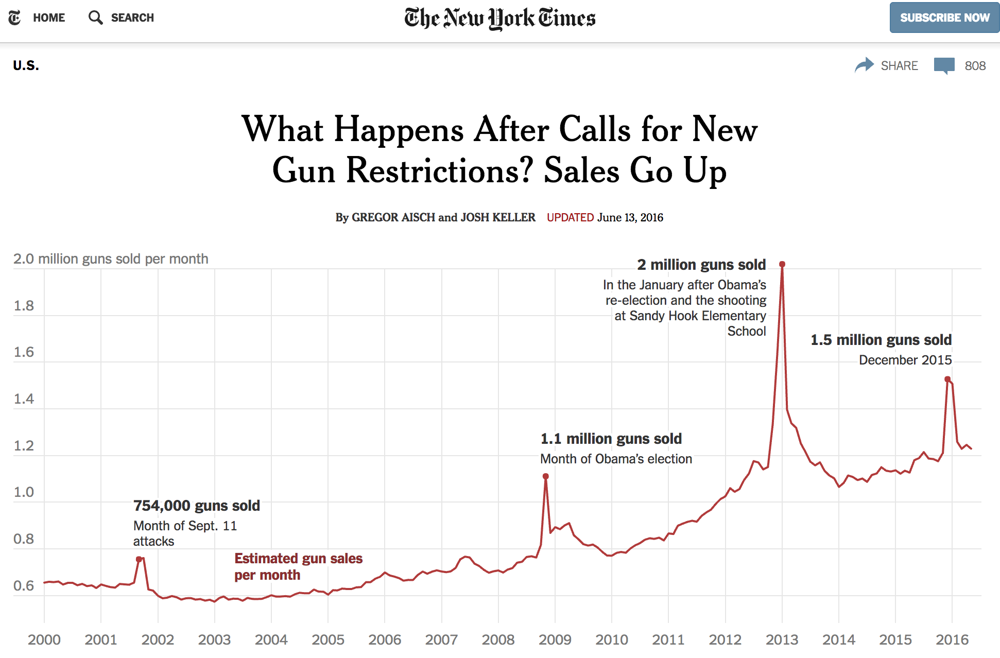

# Guns and Deaths in America
Thomas Brambor

- [Introduction](#introduction)
- [Data Sources](#data-sources)
  - [Setup](#setup)
  - [Gun Ownership (RAND)](#gun-ownership-rand)
  - [Gun Sales (NY Times)](#gun-sales-ny-times)
  - [Firearm Deaths (Kaiser Family
    Foundation)](#firearm-deaths-kaiser-family-foundation)
  - [Individual-Level Deaths
    (FiveThirtyEight)](#individual-level-deaths-fivethirtyeight)
  - [State Firearm Laws](#state-firearm-laws)
- [Analysis Topics](#analysis-topics)
- [Exercises](#exercises)
  - [1. State-Level Analysis](#1-state-level-analysis)
  - [2. Time Series Patterns](#2-time-series-patterns)
  - [3. Demographic Analysis](#3-demographic-analysis)
  - [4. Policy Impact Analysis](#4-policy-impact-analysis)
  - [5. Advanced Integration Project](#5-advanced-integration-project)
  - [Sharing Guidelines](#sharing-guidelines)

# Introduction

- In preparation for your first homework assignment, I would like you to
  do an exploration of some data similar to what I will ask you next
  week for the first graded assignment.
- This is not required. Choose to invest as little or as much time as
  you feel appropriate. But this is the way to learn and apply the
  things we cover in lecture and the tutorials I asked you to complete.
- Advantage is that for this exercise you can share, ask questions
  freely, and get to know `plotnine` / `altair` / `seaborn` better if
  you have not already.
- I have collected a few data sources that may be helpful to the
  analysis. Feel free to use them, combine them, or even add other
  sources if you feel ambitious.

**Task:** Explore the relationship between gun ownership, gun laws, and
gun-related deaths in America. Try to first *explore the data* and then
think about which aspects of the things you learned you want to present
to a reader.



# Data Sources

## Setup

``` python
import pandas as pd
import numpy as np
import seaborn as sns
import matplotlib.pyplot as plt
from plotnine import *  # For ggplot-style plotting
import altair as alt    # For interactive visualizations
```

## Gun Ownership (RAND)

RAND has collected state-level data on household firearm ownership in
this [study](https://www.rand.org/pubs/tools/TL354.html).

``` python
gun_ownership = pd.read_csv("data/gun_ownership.csv")
gun_ownership.head(10)
```

<div>
<style scoped>
    .dataframe tbody tr th:only-of-type {
        vertical-align: middle;
    }
&#10;    .dataframe tbody tr th {
        vertical-align: top;
    }
&#10;    .dataframe thead th {
        text-align: right;
    }
</style>

|     | FIP | Year | STATE   | HFR   | HFR_se | universl | permit | Fem_FS_S | Male_FS_S | BRFSS | GALLUP    | GSS       | PEW  | HuntLic  | GunsAmmo  | BackChk | PewQChng | BS1  | BS2  | BS3 |
|-----|-----|------|---------|-------|--------|----------|--------|----------|-----------|-------|-----------|-----------|------|----------|-----------|---------|----------|------|------|-----|
| 0   | 1   | 1980 | Alabama | 0.608 | 0.031  | 0        | 0      | 0.824324 | 0.833795  | -9.0  | 0.553950  | 0.583632  | -9.0 | 0.291102 | -0.509164 | -9.0    | 0        | 0.00 | 0.00 | 0.0 |
| 1   | 1   | 1981 | Alabama | 0.597 | 0.047  | 0        | 0      | 0.692308 | 0.831126  | -9.0  | -9.000000 | -9.000000 | -9.0 | 0.294962 | -0.618954 | -9.0    | 0        | 1.00 | 0.00 | 0.0 |
| 2   | 1   | 1982 | Alabama | 0.661 | 0.036  | 0        | 0      | 0.771739 | 0.821429  | -9.0  | -9.000000 | 0.655196  | -9.0 | 0.290545 | -0.526692 | -9.0    | 0        | 2.00 | 0.00 | 0.0 |
| 3   | 1   | 1983 | Alabama | 0.586 | 0.038  | 0        | 0      | 0.688172 | 0.819277  | -9.0  | 0.611440  | -9.000000 | -9.0 | 0.284983 | -0.713227 | -9.0    | 0        | 3.00 | 0.00 | 0.0 |
| 4   | 1   | 1984 | Alabama | 0.624 | 0.036  | 0        | 0      | 0.710000 | 0.775956  | -9.0  | -9.000000 | 0.626933  | -9.0 | 0.281622 | -0.733305 | -9.0    | 0        | 4.00 | 0.00 | 0.0 |
| 5   | 1   | 1985 | Alabama | 0.644 | 0.031  | 0        | 0      | 0.755556 | 0.835294  | -9.0  | 0.611974  | 0.662106  | -9.0 | 0.278214 | -0.719122 | -9.0    | 0        | 5.00 | 0.00 | 0.0 |
| 6   | 1   | 1986 | Alabama | 0.567 | 0.038  | 0        | 0      | 0.686869 | 0.777778  | -9.0  | 0.596843  | -9.000000 | -9.0 | 0.275302 | -0.732234 | -9.0    | 0        | 6.00 | 0.00 | 0.0 |
| 7   | 1   | 1987 | Alabama | 0.609 | 0.036  | 0        | 0      | 0.711340 | 0.795455  | -9.0  | -9.000000 | 0.586605  | -9.0 | 0.278852 | -0.842906 | -9.0    | 0        | 7.00 | 0.00 | 0.0 |
| 8   | 1   | 1988 | Alabama | 0.606 | 0.031  | 0        | 0      | 0.638095 | 0.804071  | -9.0  | 0.768345  | 0.505046  | -9.0 | 0.273267 | -0.835570 | -9.0    | 0        | 7.91 | 0.09 | 0.0 |
| 9   | 1   | 1989 | Alabama | 0.627 | 0.031  | 0        | 0      | 0.714286 | 0.801471  | -9.0  | 0.702464  | 0.583599  | -9.0 | 0.269243 | -0.646931 | -9.0    | 0        | 8.73 | 0.27 | 0.0 |

</div>

The data includes: - HFR: Household firearm ownership rate - HFR_se:
Standard error of the household firearm rate - Various survey indicators
(BRFSS, GALLUP, GSS, PEW) - Hunting license and background check data

## Gun Sales (NY Times)

``` python
gunsales = pd.read_csv("data/gun_sales.csv")
gunsales.head(10)
```

<div>
<style scoped>
    .dataframe tbody tr th:only-of-type {
        vertical-align: middle;
    }
&#10;    .dataframe tbody tr th {
        vertical-align: top;
    }
&#10;    .dataframe thead th {
        text-align: right;
    }
</style>

|     | state                | year | month    | month.num | population | guns_per_thousand | guns_sold | multiplier | instore_purchases | permit | ... | returned_other | rental_handgun | rental_longgun | private_handgun | private_longgun | private_other | privatereturn_handgun | privatereturn_longgun | privatereturn_other | totals |
|-----|----------------------|------|----------|-----------|------------|-------------------|-----------|------------|-------------------|--------|-----|----------------|----------------|----------------|-----------------|-----------------|---------------|-----------------------|-----------------------|---------------------|--------|
| 0   | Alabama              | 1998 | November | 11        | 4822023.0  | 0.244545          | 1177.0    | 1.1        | 1072.0            | 0.0    | ... | NaN            | NaN            | NaN            | NaN             | NaN             | NaN           | NaN                   | NaN                   | NaN                 | 1062   |
| 1   | Alaska               | 1998 | November | 11        | 731449.0   | 0.215053          | 157.0     | 1.1        | 143.0             | 4.0    | ... | NaN            | NaN            | NaN            | NaN             | NaN             | NaN           | NaN                   | NaN                   | NaN                 | 145    |
| 2   | Arizona              | 1998 | November | 11        | 6553255.0  | 0.065296          | 426.0     | 1.1        | 389.0             | 0.0    | ... | NaN            | NaN            | NaN            | NaN             | NaN             | NaN           | NaN                   | NaN                   | NaN                 | 379    |
| 3   | Arkansas             | 1998 | November | 11        | 2949131.0  | 0.223795          | 658.0     | 1.1        | 600.0             | 0.0    | ... | NaN            | NaN            | NaN            | NaN             | NaN             | NaN           | NaN                   | NaN                   | NaN                 | 589    |
| 4   | California           | 1998 | November | 11        | 38041430.0 | 0.048203          | 1834.0    | 1.1        | 1667.0            | 434.0  | ... | NaN            | NaN            | NaN            | NaN             | NaN             | NaN           | NaN                   | NaN                   | NaN                 | 2101   |
| 5   | Colorado             | 1998 | November | 11        | 5187582.0  | 0.137193          | 707.0     | 1.1        | 647.0             | 0.0    | ... | NaN            | NaN            | NaN            | NaN             | NaN             | NaN           | NaN                   | NaN                   | NaN                 | 622    |
| 6   | Connecticut          | 1998 | November | 11        | 3590347.0  | 0.016544          | 59.0      | 1.1        | 54.0              | 17.0   | ... | NaN            | NaN            | NaN            | NaN             | NaN             | NaN           | NaN                   | NaN                   | NaN                 | 80     |
| 7   | Delaware             | 1998 | November | 11        | 917092.0   | 0.067169          | 61.0      | 1.1        | 56.0              | 0.0    | ... | NaN            | NaN            | NaN            | NaN             | NaN             | NaN           | NaN                   | NaN                   | NaN                 | 55     |
| 8   | District of Columbia | 1998 | November | 11        | 635040.0   | 0.000000          | 0.0       | 1.1        | 0.0               | 0.0    | ... | NaN            | NaN            | NaN            | NaN             | NaN             | NaN           | NaN                   | NaN                   | NaN                 | 0      |
| 9   | Florida              | 1998 | November | 11        | 19317568.0 | 0.044529          | 858.0     | 1.1        | 782.0             | 0.0    | ... | NaN            | NaN            | NaN            | NaN             | NaN             | NaN           | NaN                   | NaN                   | NaN                 | 812    |

<p>10 rows × 35 columns</p>
</div>

## Firearm Deaths (Kaiser Family Foundation)

``` python
gun_deaths = pd.read_csv("data/gun_deaths.csv")
gun_deaths.head(10)
```

<div>
<style scoped>
    .dataframe tbody tr th:only-of-type {
        vertical-align: middle;
    }
&#10;    .dataframe tbody tr th {
        vertical-align: top;
    }
&#10;    .dataframe thead th {
        text-align: right;
    }
</style>

|     | location | year | firearms_death_100k |
|-----|----------|------|---------------------|
| 0   | Alabama  | 1999 | 17.7                |
| 1   | Alabama  | 2000 | 17.2                |
| 2   | Alabama  | 2001 | 16.4                |
| 3   | Alabama  | 2002 | 16.1                |
| 4   | Alabama  | 2003 | 16.9                |
| 5   | Alabama  | 2004 | 14.8                |
| 6   | Alabama  | 2005 | 16.0                |
| 7   | Alabama  | 2006 | 16.8                |
| 8   | Alabama  | 2007 | 17.3                |
| 9   | Alabama  | 2008 | 17.3                |

</div>

## Individual-Level Deaths (FiveThirtyEight)

``` python
gun_inddeaths = pd.read_csv("data/gun_deaths_individual.csv")
gun_inddeaths.head(10)
```

<div>
<style scoped>
    .dataframe tbody tr th:only-of-type {
        vertical-align: middle;
    }
&#10;    .dataframe tbody tr th {
        vertical-align: top;
    }
&#10;    .dataframe thead th {
        text-align: right;
    }
</style>

|     | year | month | intent       | police | sex | age  | race                           | hispanic | place           | education    |
|-----|------|-------|--------------|--------|-----|------|--------------------------------|----------|-----------------|--------------|
| 0   | 2012 | 1     | Suicide      | 0      | M   | 34.0 | Asian/Pacific Islander         | 100      | Home            | BA+          |
| 1   | 2012 | 1     | Suicide      | 0      | F   | 21.0 | White                          | 100      | Street          | Some college |
| 2   | 2012 | 1     | Suicide      | 0      | M   | 60.0 | White                          | 100      | Other specified | BA+          |
| 3   | 2012 | 2     | Suicide      | 0      | M   | 64.0 | White                          | 100      | Home            | BA+          |
| 4   | 2012 | 2     | Suicide      | 0      | M   | 31.0 | White                          | 100      | Other specified | HS/GED       |
| 5   | 2012 | 2     | Suicide      | 0      | M   | 17.0 | Native American/Native Alaskan | 100      | Home            | Less than HS |
| 6   | 2012 | 2     | Undetermined | 0      | M   | 48.0 | White                          | 100      | Home            | HS/GED       |
| 7   | 2012 | 3     | Suicide      | 0      | M   | 41.0 | Native American/Native Alaskan | 100      | Home            | HS/GED       |
| 8   | 2012 | 2     | Accidental   | 0      | M   | 50.0 | White                          | 100      | Other specified | Some college |
| 9   | 2012 | 2     | Suicide      | 0      | M   | NaN  | Black                          | 998      | Home            | NaN          |

</div>

## State Firearm Laws

``` python
gun_laws = pd.read_csv("data/gun_laws.csv")
gun_laws.head(10)
```

<div>
<style scoped>
    .dataframe tbody tr th:only-of-type {
        vertical-align: middle;
    }
&#10;    .dataframe tbody tr th {
        vertical-align: top;
    }
&#10;    .dataframe thead th {
        text-align: right;
    }
</style>

|     | state       | year | felony | invcommitment | invoutpatient | danger | drugmisdemeanor | alctreatment | alcoholism | relinquishment | ... | expartedating | dvrosurrender | dvrosurrendernoconditions | dvrosurrenderdating | expartesurrender | expartesurrendernoconditions | expartesurrenderdating | dvroremoval | stalking | lawtotal |
|-----|-------------|------|--------|---------------|---------------|--------|-----------------|--------------|------------|----------------|-----|---------------|---------------|---------------------------|---------------------|------------------|------------------------------|------------------------|-------------|----------|----------|
| 0   | Alabama     | 1991 | 0      | 0             | 0             | 0      | 0               | 0            | 1          | 0              | ... | 0             | 0             | 0                         | 0                   | 0                | 0                            | 0                      | 0           | 0        | 15       |
| 1   | Alaska      | 1991 | 1      | 0             | 0             | 0      | 0               | 0            | 0          | 0              | ... | 0             | 0             | 0                         | 0                   | 0                | 0                            | 0                      | 0           | 0        | 10       |
| 2   | Arizona     | 1991 | 0      | 1             | 1             | 1      | 0               | 0            | 0          | 0              | ... | 0             | 0             | 0                         | 0                   | 0                | 0                            | 0                      | 0           | 0        | 12       |
| 3   | Arkansas    | 1991 | 1      | 1             | 0             | 1      | 0               | 0            | 0          | 0              | ... | 0             | 0             | 0                         | 0                   | 0                | 0                            | 0                      | 0           | 0        | 15       |
| 4   | California  | 1991 | 1      | 1             | 0             | 1      | 0               | 0            | 1          | 0              | ... | 0             | 0             | 0                         | 0                   | 0                | 0                            | 0                      | 0           | 0        | 58       |
| 5   | Colorado    | 1991 | 0      | 0             | 0             | 0      | 0               | 0            | 0          | 0              | ... | 0             | 0             | 0                         | 0                   | 0                | 0                            | 0                      | 0           | 0        | 9        |
| 6   | Connecticut | 1991 | 0      | 0             | 0             | 0      | 0               | 0            | 0          | 0              | ... | 0             | 0             | 0                         | 0                   | 0                | 0                            | 0                      | 0           | 0        | 27       |
| 7   | Delaware    | 1991 | 1      | 0             | 0             | 1      | 1               | 0            | 0          | 0              | ... | 0             | 0             | 0                         | 0                   | 0                | 0                            | 0                      | 0           | 0        | 12       |
| 8   | Florida     | 1991 | 1      | 0             | 0             | 0      | 0               | 0            | 0          | 0              | ... | 0             | 0             | 0                         | 0                   | 0                | 0                            | 0                      | 0           | 0        | 18       |
| 9   | Georgia     | 1991 | 1      | 0             | 0             | 0      | 0               | 0            | 0          | 0              | ... | 0             | 0             | 0                         | 0                   | 0                | 0                            | 0                      | 0           | 0        | 12       |

<p>10 rows × 137 columns</p>
</div>

# Analysis Topics

Using these data sets, here are several possible questions to explore:

- Gun Ownership vs. Firearm Deaths: How does the rate of gun ownership
  in different states correlate with the number of deaths due to
  firearms? Does gun ownership correlate with firearm deaths in the
  U.S.? Does the pattern hold only in the aggregate or also by state?

- Trends in Gun-related Deaths: What are the trends in gun-related
  deaths at the individual level over time? Use the FiveThirtyEight data
  to explore trends and patterns, possibly breaking down the data by
  factors like age, gender, or type of incident (e.g., homicide,
  suicide, accidental).

- Impact of Events on Gun Sales: Can significant events (like mass
  shootings or political changes) be linked to spikes in gun sales? Use
  the NYTimes gunsales data to visualize changes over time and correlate
  these with major national or international events.

- Effectiveness of Gun Laws: Analyze the impact of different state
  firearm laws on gun-related deaths and gun sales. This would involve a
  comparison between the State Firearm Database and the other datasets
  on gun deaths and gun ownership. Are gun regulations (e.g. child
  access prevention laws) associated with lower gun death rates? How
  about suicides (especially by non-adults)?

- Demographic Analysis of Gun Deaths: Who are the victims of gun-related
  deaths? Using the individual-level data from FiveThirtyEight, analyze
  the demographics of victims, including age, sex, race, and the
  circumstances of their deaths (suicide, homicide, accidental).

- Time Series Analysis of Gun Sales: How have gun sales changed over
  time across different states? Use time series visualizations to
  explore trends in gun sales data from the NYTimes dataset.

- Comparative Analysis of State Gun Laws: How do state gun laws vary
  across the U.S., and have there been significant changes in
  legislation over time? Use the State Firearm Database to create
  visualizations that track the evolution of gun laws across different
  states and time periods.

# Exercises

Choose one or more of the following exercises to explore. For each
analysis, consider: - What is the story you want to tell? - Which
visualization type best supports your narrative? - How can you make the
visualization clear and impactful?

## 1. State-Level Analysis

Explore the relationship between gun ownership and deaths across states:

**Suggested approaches:**  
- Compare HFR (household firearm rates) with death rates  
- Group states by region or political leaning  
- Consider controlling for population or other demographic factors  
- Look for outliers and investigate their characteristics

**Key variables to consider:**  
- From gun_ownership: HFR, STATE  
- From gun_deaths: firearms_death_100k, location

## 2. Time Series Patterns

Analyze temporal patterns in gun sales and related events:

**Suggested approaches:**  
- Identify significant spikes in gun sales  
- Compare sales patterns across different states/regions  
- Look for seasonal patterns  
- Connect trends to major events (elections, mass shootings, policy
changes)

**Key variables to consider:**  
- From gunsales: month, totals, state  
- Consider external data on major events

## 3. Demographic Analysis

Investigate who is most affected by gun violence:

**Suggested approaches:**  
- Break down deaths by age groups, gender, and race  
- Compare urban vs rural patterns  
- Analyze different types of incidents (suicide, homicide, accident)  
- Look for demographic trends over time

**Key variables to consider:**  
- From gun_inddeaths: age, sex, race, intent

## 4. Policy Impact Analysis

Examine the relationship between gun laws and outcomes:

**Suggested approaches:**  
- Compare states with different types of gun laws  
- Look at changes before/after law implementation  
- Consider specific types of restrictions (e.g., background checks,
waiting periods)  
- Account for neighboring state policies

**Key variables to consider:**  
- From gun_laws: Various policy indicators  
- Compare with death rates and sales data

## 5. Advanced Integration Project

Combine multiple datasets to tell a comprehensive story:

**Suggested approaches:**  
- Pick a specific state or region to analyze in depth  
- Follow changes over time in multiple metrics

**Tips for analysis:**  
- Start with exploratory data analysis  
- Look for unexpected patterns  
- Consider confounding variables  
- Document your analytical choices

## Sharing Guidelines

When sharing your analysis: 1. Clearly state your research question 2.
Explain your data preparation steps 3. Justify your visualization
choices 4. Document any assumptions made 5. Discuss limitations of the
analysis 6. Suggest areas for further investigation

Upload your analysis to the `sandbox` repository in a folder called
`Week02_guns`.
